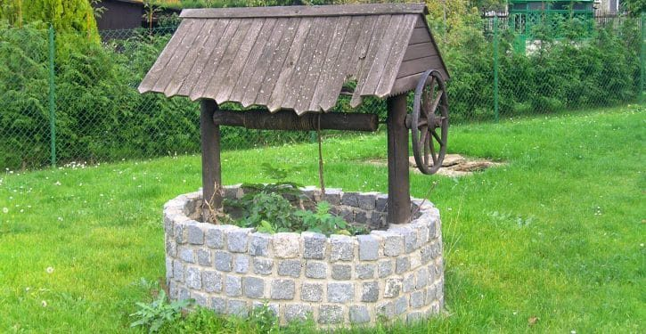
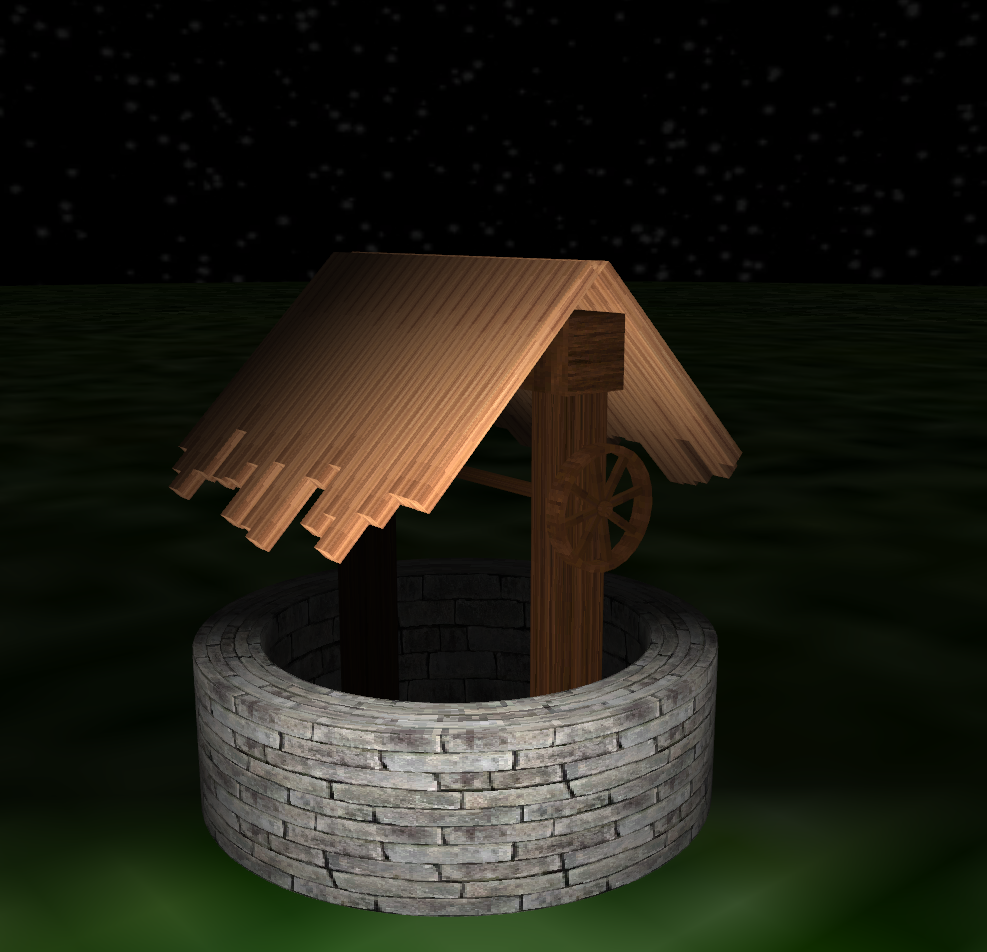

# Studnia z kołowrotkiem

## Zdjęcie modelowanej studni

## Zdjęcie gotowej studni

## Podział pracy

* Jakub Mazurkiewicz - generowanie modeli, architektura programu
* Damian Piotrowski - oświetlenie, tekstury
* Jan Such - praca kamery
* Piotr Lewandowski - hmm

## Milestones

* Uruchomienie wersji przykładowej [DONE]
* Stworzenie uproszczonych modeli testowych i oświetlenia [DONE]
* Praca kamery [DONE]
* Model studni [DONE]
* Dopracowanie oświetlenia / kamery [DONE]
* Interaktywność (kołowrót oraz intensywność światła) [DONE]
* Zaprezentowanie skończonego projektu
