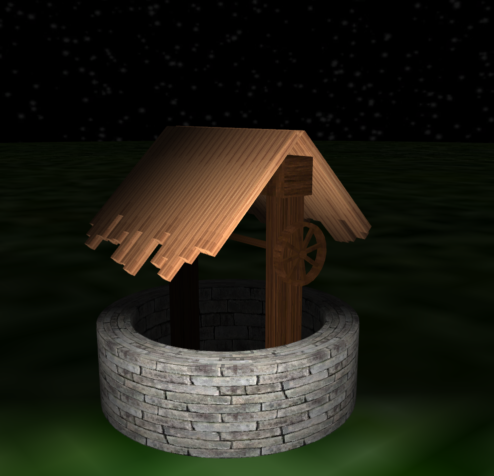

# Well with wheel

## Overview

### Reference photo

### Finished Model

### Building

Use Visual Studio 19 to build program.

## Movement

Camera:

* WASD - change position
* Mouse - change view angle
* Space/Ctrl - up/down

Wheel:

* Left arrow - rotate left
* Right arrow - rotate right

## Team

* Jakub Mazurkiewicz ([@JMazurkiewicz](https://github.com/JMazurkiewicz)) - model generation, program architecture, refactorization, introduction of C++20 features
* Damian Piotrowski ([@dam1508](https://github.com/dam1508)) - light, textures
* Jan Such ([@JeffHathford](https://github.com/JeffHathford)) - camera and movement
