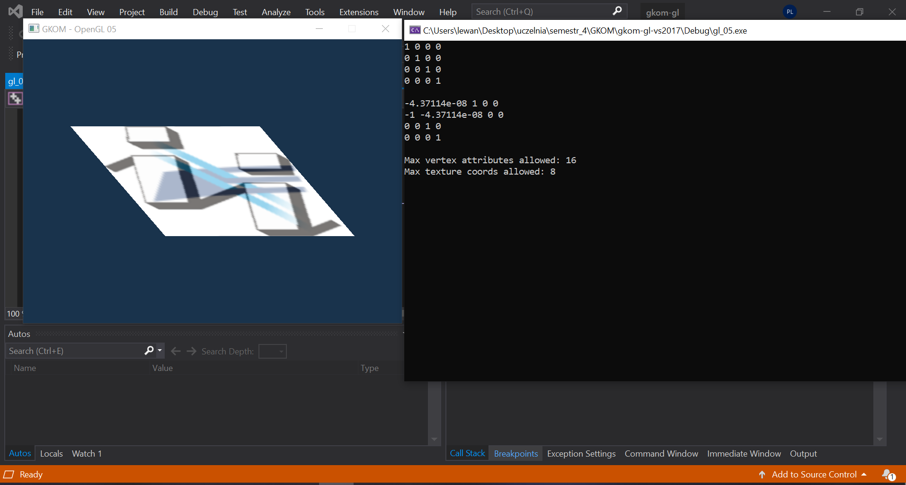

# Studnia z kołowrotkiem

## Zdjęcie planowanej studni

## VS 19

## Podział pracy

* Jakub Mazurkiewicz - model studni
* Damian Piotrowski - oświetlenie
* Piotr Lewandowski - model studni
* Jan Such - praca kamery / oświetlenie

## Milestones

* Uruchomienie wersji przykładowej
* Stworzenie uproszczonych modeli testowych i oświetlenia
* Praca kamery
* Model studni
* Dopracowanie oświetlenia / kamery
* Interaktywność (kołowrót oraz intensywność światła)
* Poprawki
* Zaprezentowanie skończonego projektu
